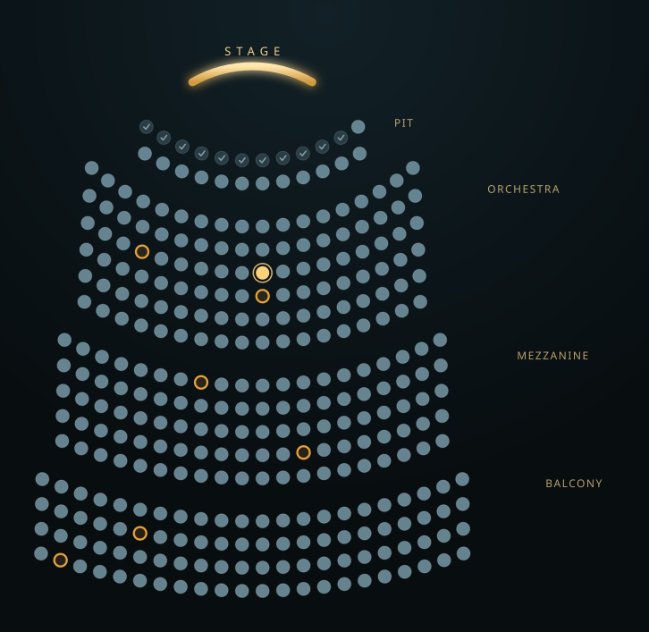
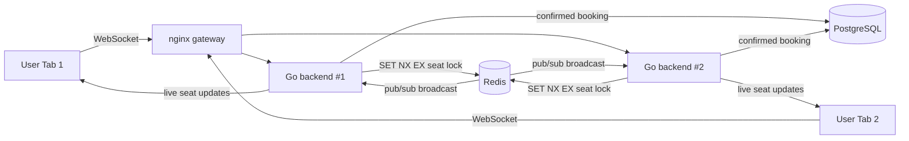
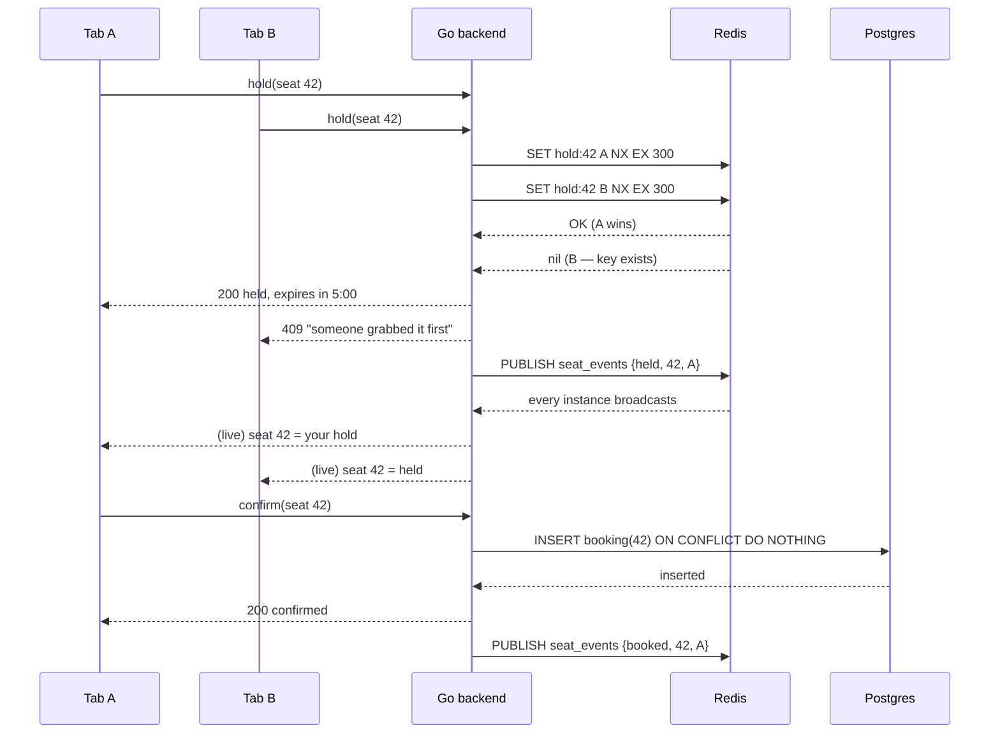

# GrabSeat

[](https://github.com/vppatel4/GrabSeat/actions/workflows/ci.yml)

When a popular show goes on sale, hundreds of people reach for the same seats in
the same instant. GrabSeat is a small, real system that solves the hard part of
that moment: **if two people click the same seat at the same millisecond, exactly
one of them wins, the other gets an immediate and clear "someone got there first,"
and a double-booking is impossible** — all while everyone watching sees the seat
map change live.

There's no login. Open the app, you get a random session id per browser tab, and
you can pick seats. Open a second tab and you have a second "person" — race
yourself for the same seat and watch one tab win. That's the whole demo, with
zero setup beyond Docker.



> The image above is the live seat map (open seats in steel, your hold glowing
> gold, others' holds in amber, booked seats checked off). An animated 60–90s
> screen recording of the race, the live expiry, and a confirm goes here as
> `docs/media/demo.gif` once recorded — see [docs/DEMO.md](docs/DEMO.md) for the
> shot list.

---

## The guarantee, and how it's kept

The seat map has three states — open, held, booked — and one rule: **a seat can
only ever be booked by one session.** GrabSeat keeps that rule with two different
data stores doing two different jobs:

- **Redis** holds the short-lived "who is holding what" locks. Grabbing a seat is
  a single atomic Redis command — `SET seat NX EX` — which means "set this key
  only if it doesn't already exist, and auto-delete it in a few minutes." When two
  requests hit that command at the same instant, Redis lets exactly one succeed.
  The auto-expiry means an abandoned hold releases itself with no cleanup job.
- **Postgres** holds the permanent bookings, with a `UNIQUE` constraint on the
  seat. Even if a bug ever let two confirms slip past the Redis lock, the database
  physically cannot store two bookings for one seat.

So there are two independent guarantees stacked on top of each other: Redis makes
the *race* come out right in the common path, and Postgres makes a double-booking
*impossible* as a last line of defense.

## Architecture



The gateway lets several backend instances run at once. A booking handled by
backend #2 is broadcast over Redis pub/sub to backend #1, which pushes it to the
browsers connected to *it* — so the design is genuinely distributed, not a single
process holding all the connections.

### What happens when two people click the same seat



## Tech stack

| Layer | Technology | Used for | Why this choice |
|---|---|---|---|
| Backend | Go | HTTP + WebSocket server, lock logic, orchestration | Strong fit for high-concurrency systems; goroutines/channels map directly to what this project shows |
| Locking / pub-sub | Redis (local Docker) | Atomic seat holds, cross-instance broadcast | The mechanism that actually resolves the race; free and local |
| Persistence | PostgreSQL (local Docker) | Confirmed bookings, event/seat metadata | Durable source of truth with a unique constraint as a hard backstop |
| Real-time transport | WebSockets | Pushing live seat changes to clients | Instant updates, no polling |
| Frontend | Next.js + TypeScript + Tailwind | Seat-map UI, hold countdown, confirm flow | Fast dev loop, real component model |
| Gateway | nginx | Load-balancing across backend instances | Proves the multi-instance pub/sub path end to end |
| Load testing | k6 | Simulating many concurrent buyers | Free, produces real reportable numbers |
| Observability | slog + trace IDs + OpenTelemetry | Following one booking attempt end to end | Real interview topic, not decoration |
| Rate limiting | Per-session token bucket | Surviving scripted hammering | Basic API hygiene |
| Testing | Go's testing package + k6 | Unit + adversarial concurrency tests | Repeatable, committed to the repo |
| CI | GitHub Actions | Running the test suite on every push | Free on public repos |
| Containerization | Docker + Docker Compose | One-command local run | Zero-signup setup |

## How it works, step by step

1. **You open the app.** The browser mints a random session id (one per tab) and
   opens a WebSocket. The server's first message is a full snapshot of the seat
   map, so the page always starts from the truth.
2. **You click an open seat.** The browser asks the backend to hold it. The
   backend runs the atomic Redis hold. If it wins, the seat is yours for a few
   minutes; if it loses, you get an immediate, specific rejection.
3. **Everyone sees it instantly.** On a successful hold the backend publishes a
   "held" event to Redis pub/sub. Every backend instance receives it and pushes it
   to its connected browsers, so every seat map turns that seat amber at once.
4. **You confirm.** The backend writes the booking to Postgres using
   `INSERT ... ON CONFLICT DO NOTHING`. That one statement is both the
   no-double-booking guarantee and the idempotency guarantee — calling confirm
   twice (a double-click, a network retry) books once and returns the same answer.
   The seat is then broadcast as "booked."
5. **Or you walk away.** If you never confirm, the Redis hold hits its TTL and
   deletes itself. Redis fires a keyspace-expiry event; every backend hears it and
   broadcasts "freed," and the seat goes back to open for everyone — no cleanup job
   anywhere.

More detail on the design decisions is in [docs/ARCHITECTURE.md](docs/ARCHITECTURE.md).

## Run it locally

You only need Docker Desktop installed. No accounts, no cloud services.

**Windows (PowerShell):**

```powershell
copy .env.example .env
docker compose up -d --build
docker compose ps
```

**macOS / Linux:**

```bash
cp .env.example .env
docker compose up -d --build
docker compose ps
```

Then open **http://localhost:3000**.

| Service | URL / port |
|---|---|
| Frontend (seat map) | http://localhost:3000 |
| Backend gateway (API + WebSocket) | http://localhost:8080 |
| Postgres | localhost:5432 |
| Redis | localhost:6379 |

Stop everything: `docker compose down`
Fully reset (wipe the database and all bookings): `docker compose down -v`

To run several backend instances behind the gateway:

```bash
docker compose up -d --build --scale backend=2
```

> If a port is already in use on your machine, change it in `.env` (for example
> `BACKEND_PORT`, `FRONTEND_PORT`) and bring the stack back up.

## Try the race yourself

1. Open **http://localhost:3000** in two browser tabs (or two windows) side by side.
2. Pick the same open seat in both tabs at almost the same moment.
3. Exactly one tab turns the seat gold ("your hold"); the other gets a toast that
   someone grabbed it first, and shows the seat as held.
4. In the winning tab, click **Confirm booking** — the seat locks in as booked
   (a check mark) in both tabs.
5. Or don't confirm: watch the hold countdown run out and the seat turn open again,
   live, in both tabs.

## The hard tests, and the real numbers

Correctness here isn't a single happy-path demo — there's a suite of adversarial
tests in [`loadtest/`](loadtest/), all passing, covering concurrency, idempotency,
the hold-expiry boundary, WebSocket reconnect resync, rate-limit isolation, Redis
failure and recovery, and cross-instance broadcast. How to run each is in
[loadtest/README.md](loadtest/README.md).

**Concurrency stress test** (`TestConcurrencyStress`) — 150 requests stampede 10
seats at once:

- 10 holds succeed, 140 get a clean rejection, **0 double-bookings**
- every winner then confirms; the durable record shows exactly 10 bookings
- hold latency: **p50 ≈ 72 ms, p95 ≈ 81 ms**

**k6 load test** (`loadtest/stress_test.js`) — 80 concurrent virtual users, each a
distinct buyer, over a 40-second ramp:

- **243,537 requests**, ~**6,090 requests/second**
- latency **avg 11.3 ms, p95 18.5 ms**
- **0 server errors** across the entire run

These are from a local run on Docker Desktop (Windows 11), not estimates. On
different hardware the absolute numbers will differ; the shape — high throughput,
low latency, zero double-bookings, zero 500s — is the point.

## Observability

Every request gets a trace id that flows through the logs, and the
lock-acquisition and confirm code paths are wrapped in OpenTelemetry spans. Set
`OTEL_TRACES_EXPORTER=stdout` (the default) and you can watch a single booking
attempt as structured JSON logs plus real timed spans in `docker compose logs -f
backend`. Set it to `none` for quiet, high-throughput runs.

## Limitations / what I'd improve with more time

- **Snapshot fan-out cost.** Every new WebSocket connection builds its snapshot by
  scanning Redis holds and querying Postgres. That's fine for one show; for many
  concurrent events I'd cache per-event snapshots and invalidate on change.
- **Rate limiting is per-instance.** Each backend keeps its own in-memory buckets,
  so the effective limit scales with instance count. A shared Redis token bucket
  would make the limit global.
- **No seat-selection queue.** Under a true stadium stampede you'd want a virtual
  waiting room in front of the sale; right now everyone hits the hold endpoint
  directly (which is exactly why the rate limiter and atomic lock matter).
- **Frontend is on Next.js 14.** A couple of npm audit advisories only fixed in
  Next 16 remain; the app is client-rendered against the Go backend and doesn't
  use the affected features, but a bump to Next 16 is a clean future step.
- **One seeded event.** The data model supports many events; the UI and seeding
  currently focus on one to keep the concurrency story front and center.

## Repository layout

```
backend/    Go service — locking, booking, ws, observability, api
frontend/   Next.js seat-map UI
loadtest/   The adversarial test suite + k6 load test
gateway/    nginx config that load-balances the backend instances
docs/        ARCHITECTURE, DEPLOYMENT, DEMO
```
